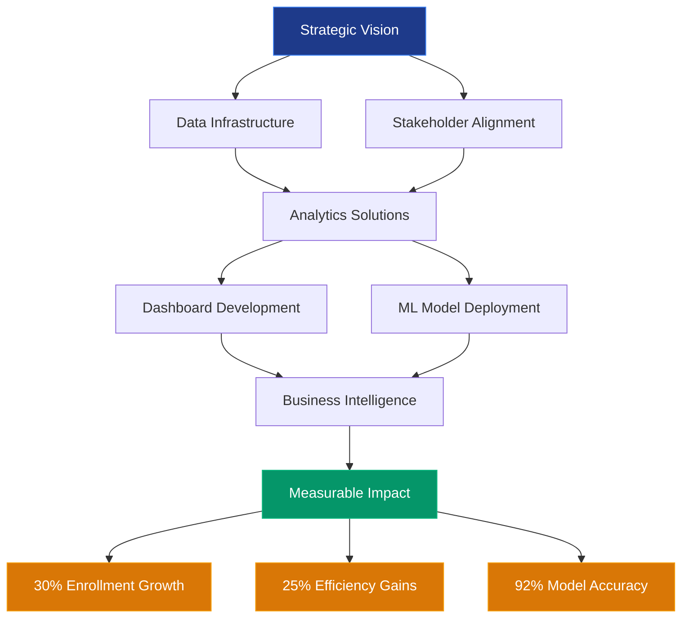
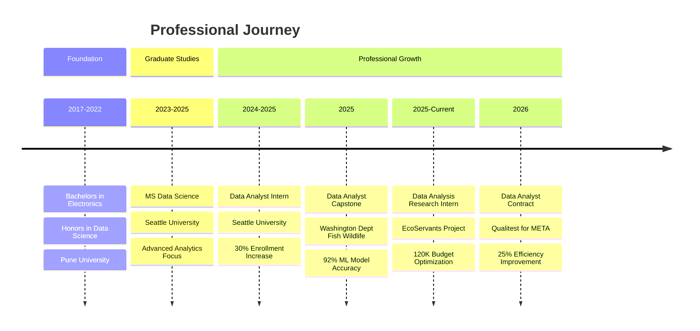
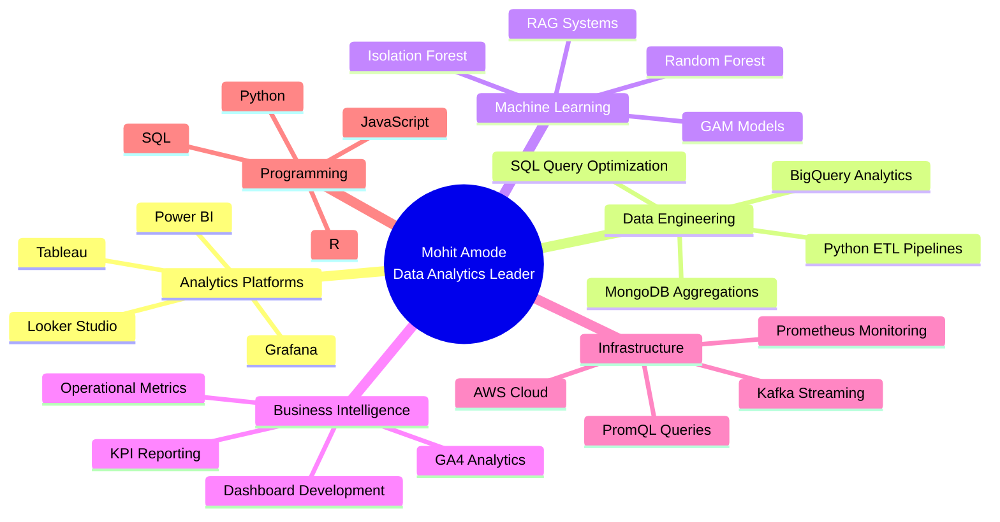

---

## 📊 EXECUTIVE SUMMARY

Data Analyst with experience in **dashboard development, SQL, MongoDB, Tableau, Power BI, and structured data analysis**. Skilled in data visualization, query optimization, reporting workflows, JSON data handling, and translating operational requirements into actionable dashboard insights — delivering measurable impact across **$120K+ annual budgets**, **30+ stakeholders**, **30% enrollment growth**, and **25% efficiency gains**.

### 🎯 LEADERSHIP IMPACT DASHBOARD

| **Metric** | **Achievement** | **Business Value** |
|:-----------|:----------------|:-------------------|
| **Stakeholder Impact** | 30+ Decision Makers | Enabled data-driven fishing permissions & university program planning |
| **Revenue Influence** | $120K Annual Budget | Optimized Google Ad Grant allocation through GA4 analytics |
| **Enrollment Growth** | +30% (200→280 students) | Identified 6 high-demand programs via SQL analysis |
| **Operational Efficiency** | 25% Rework Reduction | Quality assurance improvements for AI/ML workflows |
| **Data Processing Scale** | 250K+ Records | Automated biological & sensor data for ML pipelines |
| **Model Accuracy** | 92% (F1: 0.78) | Random Forest & GAM models for fisheries decisions |
| **Query Optimization** | 15min → Instant | MS Access & Tableau dashboards for 5 staff members |
| **Platform Growth** | 50 → 1000+ Users | Led GA4 analytics driving 74% referral traffic increase |

---

## 💡 LEADERSHIP PHILOSOPHY

> **"Transform data complexity into strategic clarity. Empower stakeholders with actionable insights that drive measurable business outcomes."**

My leadership approach centers on **translating operational requirements into scalable analytics solutions** that bridge technical excellence with business value. I believe in building **data ecosystems** that democratize insights, enabling cross-functional teams to make confident, evidence-based decisions. Through **mentorship, process optimization, and strategic dashboard development**, I've consistently delivered solutions that reduce decision-making friction while scaling organizational data maturity.

---

## 🚀 STRATEGIC IMPACT ARCHITECTURE

---

## 📈 CAREER PROGRESSION TIMELINE

---

## 🏆 KEY STRATEGIC ACHIEVEMENTS

### **Revenue & Budget Optimization**
- **$120,000 Google Ad Grant Management**: Analyzed website engagement using GA4, SQL, and JSON workflows to optimize ad spend allocation, improving operational visibility and donor engagement for EcoServants Project
- **30% Enrollment Revenue Growth**: Identified 6 high-demand study abroad programs through SQL analysis, increasing summer enrollment from 200 to 280 students, generating significant tuition revenue for Seattle University

### **Operational Excellence & Efficiency**
- **25% Rework Reduction**: Led quality assurance initiatives for META's AR/VR data collection, identifying annotation inconsistencies across 2000+ recordings, reducing engineering rework and accelerating AI/ML pipeline development
- **15-Minute to Instant Reporting**: Built MS Access databases and Tableau dashboards that eliminated manual lookup processes, enabling 5 university staff members to access program KPIs instantly
- **74% Referral Traffic Growth**: Architected GA4 analytics infrastructure for WanderWA platform, scaling from 50 to 1000+ daily active users through data-driven content optimization

### **Data-Driven Decision Making**
- **Regulatory Compliance Dashboard**: Developed PowerBI analytics platform serving 30+ WDFW stakeholders, replacing experience-based fishing permissions with data-driven biological trend analysis
- **92% ML Model Accuracy**: Built Random Forest, GAM, and Balanced RF models (F1: 0.78) for regional fisheries management, processing 250K+ biological records to improve legal crab catch decisions
- **95% Crime Prediction Accuracy**: Engineered Risk Terrain Model analyzing 170K incident records using ArcGIS Pro, supporting Seattle PD operational planning and patrol coverage optimization

### **Process Innovation & Automation**
- **300+ Data Quality Records Standardized**: Implemented taxonomy validation and geospatial mapping workflows for EcoServants, improving structured data consistency across donor and volunteer engagement systems
- **3-6 Second Query Response Time**: Built RAG-based question answering system supporting 20-minute to 3-hour videos, integrating vector search and Kafka-style streaming for scalable content analysis
- **100% Compliance Accuracy**: Validated 2000+ AR/VR recordings against CSV quality parameters for META, ensuring dataset reliability for autonomous bot training pipelines

---

## 🧠 TECHNICAL EXPERTISE ECOSYSTEM

### **Strategic Technology Stack**

**Analytics & Visualization**

**Data Engineering & Databases**

**Machine Learning & AI**

**Cloud & Infrastructure**

---

## 💼 FEATURED STRATEGIC INITIATIVES

### 🎯 **Enterprise Analytics Transformation | Washington Dept. of Fish & Wildlife**

**Challenge**: State agency relied on experience-based decisions for fishing permissions, lacking data-driven biological trend analysis.

**Strategic Approach**:
- Architected PowerBI analytics dashboard serving 30+ regulatory stakeholders
- Automated merging of 250K+ biological and sensor records into ML-ready datasets
- Deployed Random Forest, GAM, and Balanced RF models achieving 92% accuracy

**Business Impact**:
- Replaced subjective decision-making with quantitative biological insights
- Enabled evidence-based legal size crab catch regulations
- Reduced data entry errors through automated JSON/CSV workflows
- Improved regional fisheries visibility for environmental compliance

**Technologies**: PowerBI, Python, Random Forest, GAM, JSON, CSV, SQL

---

### 📊 **Budget Optimization Platform | EcoServants Project**

**Challenge**: Nonprofit needed to maximize ROI on $120K annual Google Ad Grant through data-driven engagement analysis.

**Strategic Approach**:
- Implemented GA4 analytics infrastructure with SQL and JSON reporting workflows
- Built Python/SQL-based NoSQL database architecture for donor and volunteer tracking
- Standardized 300+ plant taxonomy records with 100+ geotagged submissions

**Business Impact**:
- Optimized $120K advertising budget allocation through engagement metrics
- Improved operational visibility for donor and volunteer initiatives
- Enhanced data accessibility through structured classification workflows
- Supported nonprofit growth through regional analysis and reporting

**Technologies**: Google Analytics 4, SQL, Python, NoSQL, JSON, CSV

---

### 🚀 **Enrollment Growth Initiative | Seattle University**

**Challenge**: Study abroad office lacked data insights to identify high-demand programs and optimize enrollment.

**Strategic Approach**:
- Built MS Access databases with Tableau dashboards for instant KPI visibility
- Conducted SQL-based program demand analysis across historical enrollment data
- Reduced report lookup time from 15 minutes to instant access for 5 staff members

**Business Impact**:
- **30% enrollment increase** (200 → 280 students) in summer programs
- Identified 6 high-demand programs driving strategic resource allocation
- Improved cross-departmental reporting efficiency
- Generated significant tuition revenue through data-driven program selection

**Technologies**: MS Access, Tableau, SQL, JSON, CSV

---

### 🔍 **Quality Assurance Excellence | Qualitest (META Client)**

**Challenge**: META's AR/VR training data required rigorous validation to ensure AI/ML model reliability.

**Strategic Approach**:
- Evaluated 2000+ AR/VR recordings against structured CSV quality parameters
- Conducted multi-modal data failure analysis identifying annotation inconsistencies
- Implemented structured validation workflows for autonomous bot training pipelines

**Business Impact**:
- Achieved near **100% compliance accuracy** for AI/ML datasets
- Reduced engineering rework by **25%** through proactive issue identification
- Improved workflow precision for scalable machine learning model development
- Supported cross-functional teams with detailed reporting and data review

**Technologies**: CSV, Python, Quality Assurance Frameworks, AI/ML Pipelines

---

### 📈 **Digital Platform Analytics | WanderWA**

**Challenge**: Tourism platform needed to scale user engagement and understand traffic patterns for growth.

**Strategic Approach**:
- Led content architecture and GA4 reporting infrastructure implementation
- Analyzed user engagement trends using streaming-style event data (Kafka concepts)
- Built operational dashboards for platform activity and performance metrics

**Business Impact**:
- **74% referral traffic increase** through data-driven content optimization
- Scaled platform from **50 to 1000+ daily active users**
- Improved visibility into user behavior patterns and engagement metrics
- Enabled strategic content decisions through real-time analytics

**Technologies**: GA4, NoSQL, Kafka-style Streaming, PromQL Concepts, Dashboard Development

---

## 🎓 ACADEMIC FOUNDATION

### **Master of Science - Data Science**
**Seattle University** | September 2023 – June 2025

*Advanced Analytics • Machine Learning • Statistical Modeling • Business Intelligence*

---

### **Bachelor's (Honors in Data Science)**
**Pune University** | June 2017 – June 2022

*Electronics & Telecommunication • Data Science Specialization*

---

## 🛠️ TECHNICAL PROJECT PORTFOLIO

### **Grafana Observability Dashboard | Infrastructure Monitoring**
Developed enterprise-grade Grafana dashboards leveraging Prometheus telemetry and PromQL to monitor service health, API performance, traffic trends, and application responsiveness. Transformed time-series data into actionable operational insights for proactive monitoring.

**Impact**: Real-time operational visibility • Proactive incident detection • Performance optimization

---

### **YouTube Video Question Answering System | RAG Architecture**
Built RAG-based platform supporting 20-minute to 3-hour videos with 3-6 second query response times. Integrated vector search and Kafka-style streaming retrieval workflows for scalable long-form content analysis.

**Impact**: 3-6 second response time • Scalable video indexing • Enhanced content accessibility

---

### **WanderWA Web Analytics Dashboard | Digital Growth Analytics**
Led content architecture and GA4 reporting on structured analytics datasets, analyzing user engagement with streaming-style event data (Kafka-style concepts). Built operational dashboards that scaled the platform through data-driven content optimization.

**Impact**: 74% referral traffic growth • 50 → 1000+ daily active users • Real-time engagement visibility

---

### **Seattle Crime Hotspot Analysis | Predictive Analytics**
Analyzed 170K disturbance incident records using ArcGIS Pro and NoSQL spatial datasets. Built Risk Terrain Model achieving 95% accuracy against published reports, supporting operational planning and patrol coverage decisions.

**Impact**: 95% prediction accuracy • Improved patrol efficiency • Evidence-based resource allocation

---

## 📫 PROFESSIONAL NETWORK

### **Let's Connect**

[](mailto:mohitshyamamode@gmail